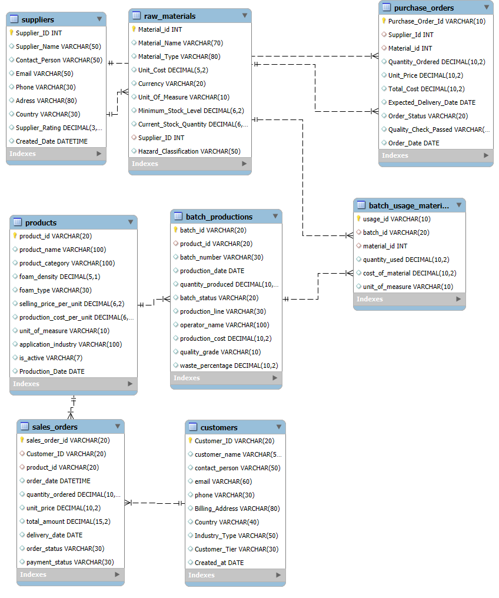

# ChemOps-Analytics-End-to-End-Manufacturing-Inventory-Intelligence
A comprehensive manufacturing analysis project that evaluates chemical production cycles and inventory health using two parallel approaches. It demonstrates how to drive business insights through advanced MySQL scripting for logic-heavy reporting and Power BI for executive-level visual analytics.

## Project Preview

## Project Overview
An end-to-end data solution for a Chemical Manufacturing firm to track the lifecycle of production—from raw material procurement and batch manufacturing to sales and customer distribution. 
The project solves the challenge of real time inventory visibility and profitability tracking.

## Project Workflow

### 1.Schema Design: 
- Developed a relational schema (ERD) to track Suppliers, Materials, Batches, and Sales.

### 2. Database Engineering: 
- Implemented the DB using MySQL, including complex constraints and stored procedures.

### 3. Analytics Layer: 
- Developed SQL queries and procedures to calculate unit costs, stock shortages, and monthly trends.

### 4.Data Visualization: 
- Connected Power BI to the DB to create an interactive executive dashboard.

## Key Features
**Live Inventory Tracking:**
Automated "Stock-on-Hand" calculation (Initial Stock vs. Batch Usage).

**Profitability Engine:**
Stored procedures to calculate actual production cost per unit vs. selling price.

**Automated Alerting:**
Conditional formatting to highlight "Out of Stock" or "Below Minimum" materials.

**Customer Segmentation:**
Analysis of sales across different industry types (Automotive, Furniture, etc.).

## Tech Stack
- MySQL
- Database: MySQL (DDL, DML, Stored Procedures, Joins, Aggregations).
- Data analysis
- Power BI Reports

## DB Schema
- `Suppliers:` Stores vendor contact information, geographic locations, and performance ratings for material sourcing.

- `Raw_Materials:` Contains the inventory catalog, including unit costs, safety classifications, and stock replenishment thresholds.

- `Purchase_Orders:` Tracks the procurement of materials, including ordered quantities, total costs, and delivery status.

- `Products:` A master list of manufactured chemical products featuring density specifications, production costs, and target industries.

- `Batch_Productions:` Logs individual manufacturing runs, tracking quantity produced, operator names, and quality grades per batch.

- `Batch_Usage_Materials:` Records the specific quantities and costs of raw materials consumed during each production batch.

- `Customers:` A CRM table containing client names, industry types (e.g., Automotive, Construction), and tier levels.

- `Sales_Orders:` Captures transaction data including quantities ordered by customers, revenue generated, and payment status.

## Power BI Dashboard Highlights
**Executive Summary:**
High-level KPIs for Total Revenue ($115K+), Profit Margin (55%), and Active Customer count.

**Sales Trends:**
Month-over-month revenue growth visualization using Area Charts.

**Inventory Status:**
A dedicated "Raw Materials Stock" table with Red/Green status indicators for immediate reordering.

**Dynamic Filtering:**
Slicers by Industry Type and Product Name for granular performance review.

## Results and Insights
**Operational Efficiency:**
Identified that 5+ raw materials (e.g., Nitrogen Gas, Carbon Black) are currently in shortage.

**Market Focus:**
The "Furniture Manufacturer" industry represents the largest revenue share (~60%).

**Profit Stability:**
Maintained a consistent 55% profit margin across various product lines.

## Summary
This project transforms raw manufacturing data into actionable business intelligence, enabling proactive inventory management and optimized production scheduling.
